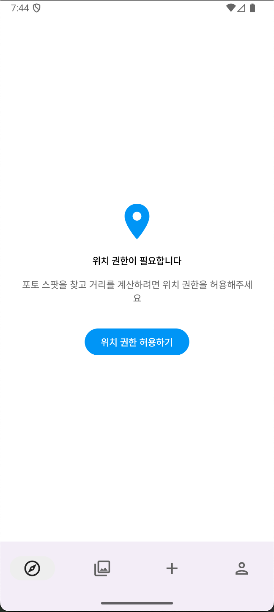
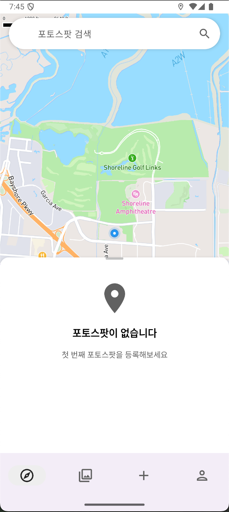
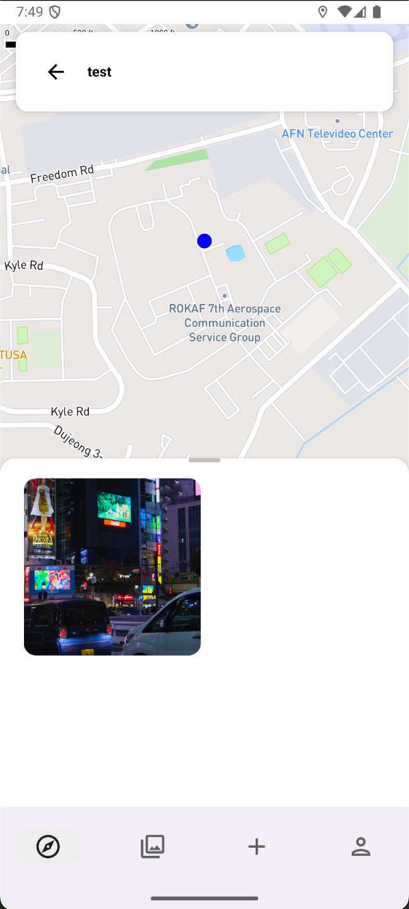
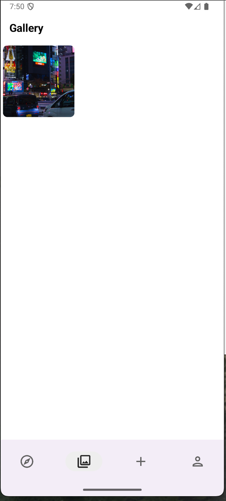
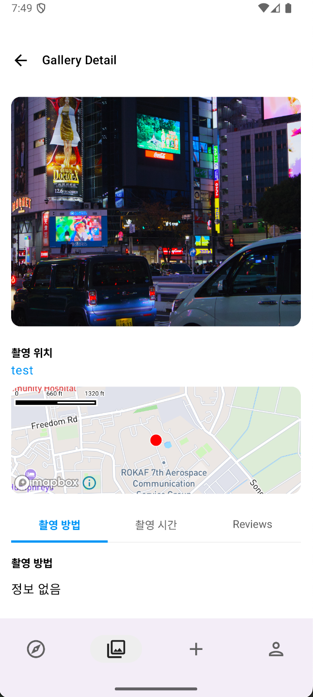
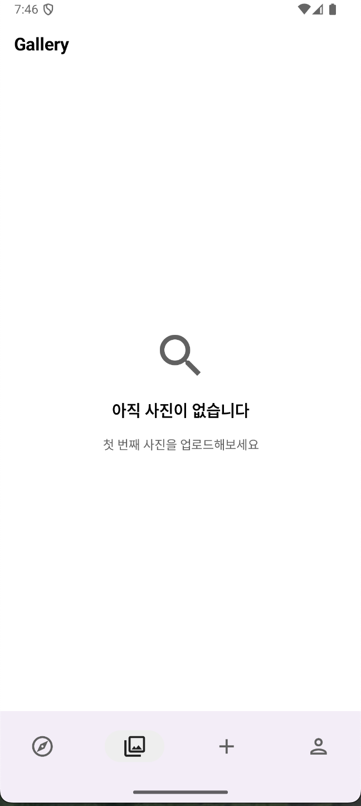
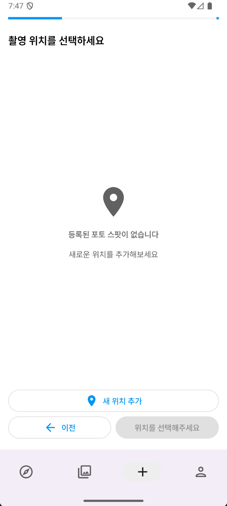
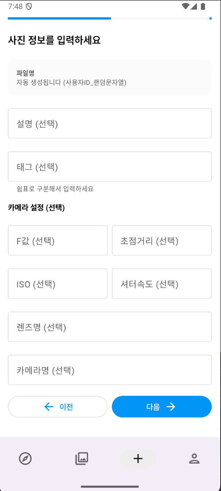
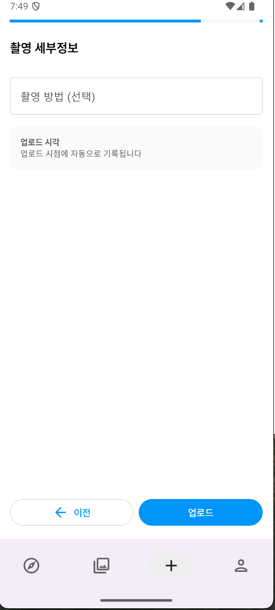
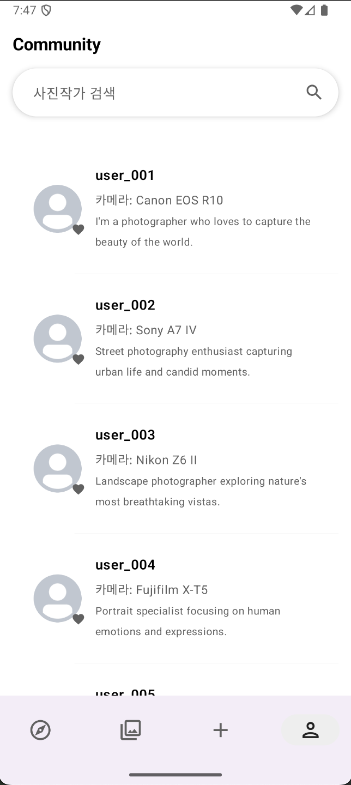

# 📸 ShutterUp

**사진을 통해 세상을 탐험하는 포토그래퍼를 위한 안드로이드 앱**

## 팀원
- [백소영](https://github.com/Merrychristmasyo)
- [주민재](https://github.com/raipier8818)

## 프로젝트 소개

ShutterUp은 포토그래퍼들이 아름다운 촬영 장소를 발견하고, 자신의 작품을 공유하며, 다른 포토그래퍼들과 소통할 수 있는 플랫폼입니다. 

### 주요 기능

#### **포토 스팟 탐색**
- 지도 기반 포토 스팟 검색 및 탐색
- 각 스팟별 사진 갯수 확인
- 위치 기반 추천 스팟 제공
- 

#### **사진 갤러리**
- 전체 사진 갤러리 탐색
- 사진 상세 정보 확인 (촬영 방법, 업로드 시간 등)
- 사진별 상세 뷰 제공

#### **사진 업로드**
- 새로운 포토 스팟에 사진 업로드
- 촬영 방법 및 메타데이터 기록
- 실시간 업로드 상태 확인

#### **프로필 관리**
- 포토그래퍼 프로필 조회
- 사용 카메라 정보 및 바이오 표시
- 다른 포토그래퍼 프로필 탐색

## 기술 스택

### Frontend
- **Jetpack Compose** - 모던 UI 프레임워크
- **Material Design 3** - 최신 디자인 시스템
- **Navigation Compose** - 화면 전환 관리
- **Coil** - 이미지 로딩 라이브러리

### Backend & Data
- **Hilt** - 의존성 주입
- **Kotlinx Serialization** - JSON 직렬화
- **Coroutines** - 비동기 처리
- **LiveData** - 반응형 데이터 관리

### Maps & Location
- **Mapbox SDK** - 지도 및 위치 서비스
- **Google Play Services Location** - 위치 권한 관리

### Architecture
- **MVVM Pattern** - ViewModel 기반 아키텍처
- **Repository Pattern** - 데이터 접근 추상화
- **Clean Architecture** - 관심사 분리

## 앱 스크린샷

### 메인 화면 (포토 스팟 탐색)
| 권한 요청 | 메인 화면 | 선택된 포토 스팟 |
|----------|----------|------------------|
|  |  |  |

### 사진 갤러리
| 갤러리 목록 | 사진 상세 보기 | 사진 없음 |
|-------------|----------------|-----------|
|  |  |  |

### 사진 업로드
| 1단계: 사진 선택 | 2단계: 위치 선택 | 3단계: 정보 입력 |
|------------------|------------------|------------------|
|  |  |  |

### 프로필 관리
| 프로필 목록 | 프로필 상세 |
|-------------|-------------|
|  |  |

## 다운로드

### APK 파일
- 또는 직접 다운로드: [ShutterUp.apk](https://github.com/Merrychristmasyo/ShutterUp/releases/download/v1.0/ShutterUp.apk)

### 설치 방법
1. APK 파일을 다운로드합니다
2. 안드로이드 설정에서 "알 수 없는 소스" 설치를 허용합니다
3. APK 파일을 실행하여 설치합니다
4. 앱을 실행하고 필요한 권한을 허용합니다

## 개발 환경 설정

### 필수 요구사항
- Android Studio Hedgehog | 2023.1.1 이상
- Android SDK 35
- Kotlin 1.9.0 이상
- JDK 11

### 설치 방법
```bash
# 저장소 클론
git clone https://github.com/your-username/ShutterUp.git

# 프로젝트 디렉토리로 이동
cd ShutterUp

# local.properties 파일에 Mapbox 토큰 추가
echo "MAPBOX_ACCESS_TOKEN=your_mapbox_token_here" >> local.properties

# 프로젝트 빌드
./gradlew build
```

### 환경 변수 설정
`local.properties` 파일에 다음을 추가하세요:
```properties
MAPBOX_ACCESS_TOKEN=your_mapbox_access_token_here
```
